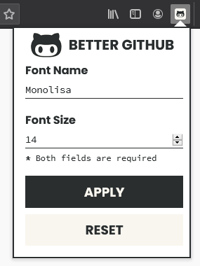
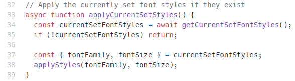
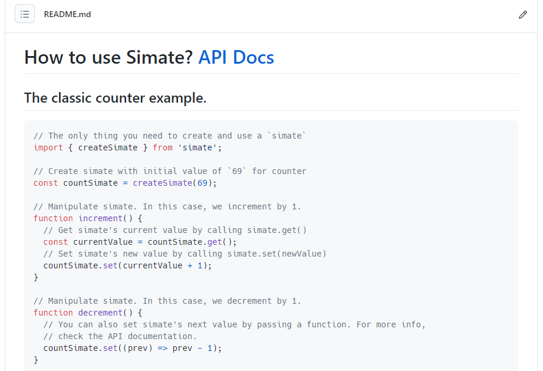
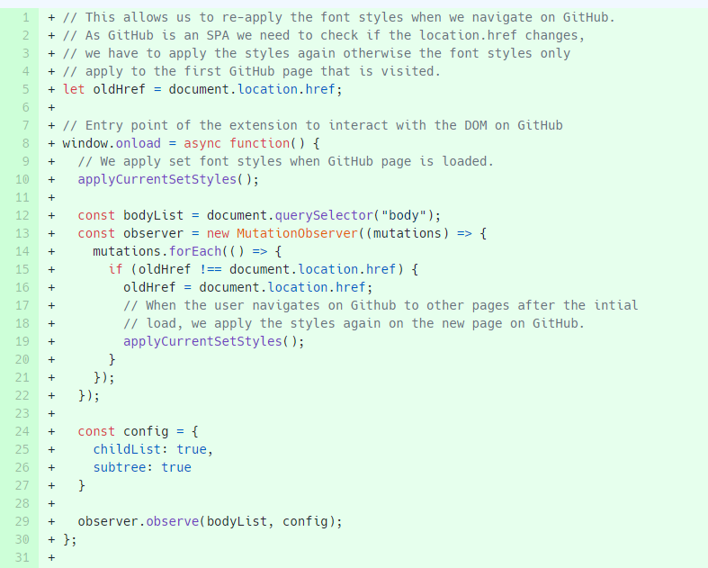

  <h1>better-github</h1>
  
🎨 Enhance your code reading experience on GitHub

    <a href="https://addons.mozilla.org/en-US/firefox/addon/bettergithub/">Firefox</a>
    <a href="#install-on-chrome">| Chrome</a>
    <a href="#donate">| Donate</a>

# Demo

# Get the extension

### [Firefox](https://addons.mozilla.org/en-US/firefox/addon/bettergithub/)

### [Chrome](#install-on-chrome)

# Features

### Simple interface to use the extension

`Better Github` allows you to apply custom fonts and modify font size of code text. These styles are applied to :

> Example below have the following Better GitHub's config: `Font Name` is [Hack](https://github.com/source-foundry/Hack) and `Font Size` is **14**.

- All the text inside a file while viewing( reading ) it.

   

- Code in README files that are inside "`<code>`" blocks also known as `<pre>` tags.

  

- Code in pull request diffs.

  

**Note:** If the custom styles are not applied( it can happen sometimes ), refresh the page.

# Motivation

Default font size of code text was very small which gave me had a hard time reading code in any repository and in PR diffs. I also wanted my code editor font and GitHub font to be same.

Couldn't find anything existing to help me solve my problem, so I created this simple yet powerful extension for Chrome browser. If something does exist though, let me know, alright?

I called it `Better GitHub` inspired by `Better Twitch TV` and `Better Discord`.

# Install on Chrome

**You will have to do it manually right now, sorry** ☹

> Might seem impossible but a $5 fee to publish it to Chrome store is not what I can afford if no one ends up needing this extension. I created this extension for myself and decided to make it public. If people like it and use it, definitely I will publish it. For now, I am sure you are a developer as this extension literally is for GitHub where you are reading this right now, so this shouldn't bother you much. Once again, sorry for the "inconvenience" but it is what it is. If you want, you can [donate](#donate) towards the project to help me publish it to [chrome web store](https://chrome.google.com/webstore/category/extensions). Publication for Firefox is free hence you can find this extension [there](https://addons.mozilla.org/en-US/firefox/addon/bettergithub/).

1. Clone/download this repository to your machine. Read [this](https://docs.github.com/en/github/creating-cloning-and-archiving-repositories/cloning-a-repository) if you don't know how.
2. Rename `manifest-chrome.json` to `manifest.json`.
3. Go to `chrome://extensions` to get to the extensions "management" page.
4. Enable `Developer mode`, by toggling the switch at the top right corner.
5. Click on `Load unpacked` button at the top left corner and a dialog box will open to select the extension.
6. Go to the repository folder's root( where the `manifest.json` file can be found ) and click on `Select Folder` button at the bottom right.

Done! You have successfully installed `Better GitHub` extension manually. Now you can disable `Developer mode` by toggling the switch back.

**Before starting to use the extension, make sure to refresh the already opened GitHub tabs otherwise the extension won't work for them but will work on newly opened tabs.**

# Donate

> I have already applied for [GitHub Sponsors](https://github.com/sponsors) and I am on the waitlist. Till then you can support the project via the methods listed below.

### [Paypal](https://paypal.me/itsShikhar)

# Todos

> Context: I created this list of tasks after I decided to make this extension public. Initially the code was very small and the font styles were hard coded. If I needed to modify the styles, I had to change it in the source code, reload the extension and refresh GitHub pages to reflect the updates. Consider this list as the roadmap for the project.

- [x] Instead of hard coding the `fontFamily` and `fontSize`, we should be able to allow the user to choose a font size and font family of their choice (which they have installed on their machine).
- [x] Create a browser action popup to show an interface to allow the user to customise their extension's settings for `fontFamily` and `fontSize`.
- [x] Integrate browser action popup with chrome API to persist and read user's settings for `fontFamily` and `fontSize` from and to the storage.
- [x] Apply styles without reloading whenever the settings are changed from the browser action popup interface.
- [x] If no custom font styles are set, load GitHub's default font styles.
- [x] User can reset font styles to GitHub's default font styles.
- [x] Add GIF to show the usage( demo ) of the extension.
- [x] Installation instructions on how to clone/download this repository, install the extension and use it.
- [x] Logo for the extension that will be used as favicon, icon, in documentation etc.
- [x] Firefox support as it was requested by [others](https://dev.to/ceoshikhar/enhance-your-code-reading-experience-on-github-with-this-chrome-extension-24ei).
- [x] Release it as an official Mozilla Firefox addon.
- [ ] Allow user to change only one property, either font name or font size instead of both properties being mandatory.
- [ ] Add `CONTRIBUTING.md` to help others so that they can contribute to the project.
